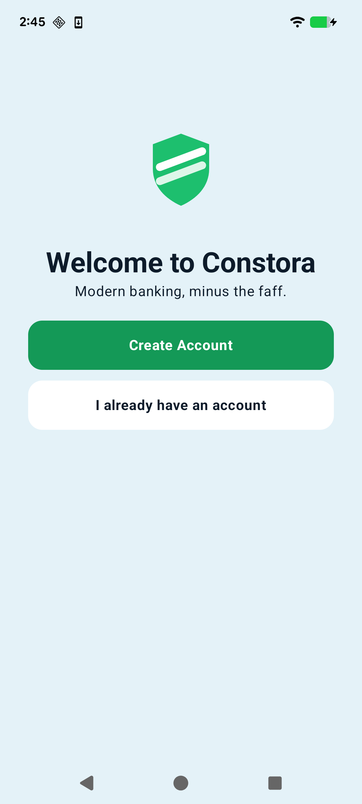
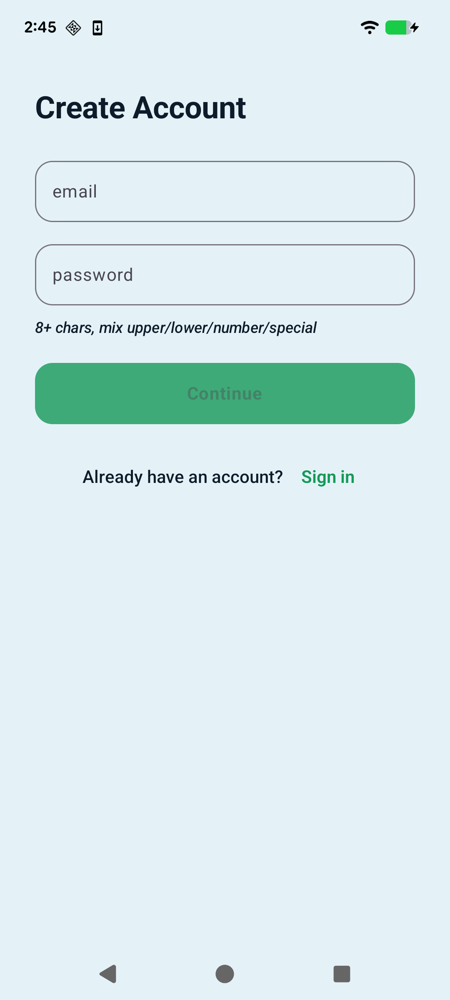
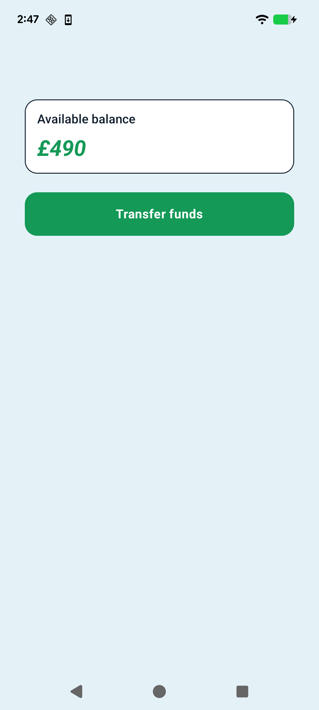
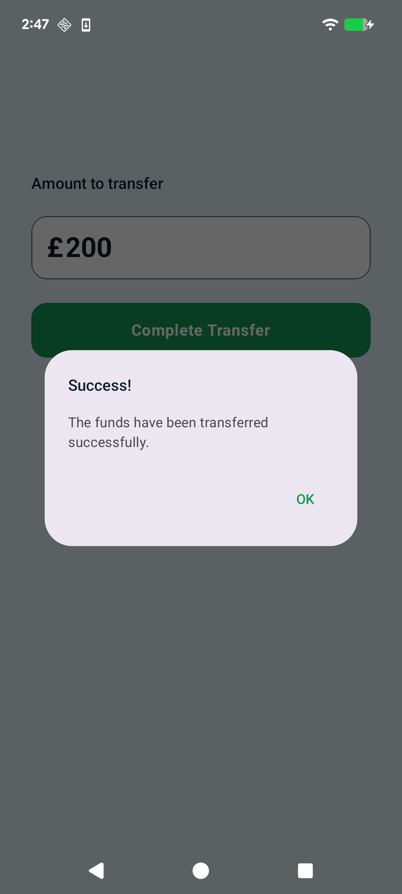

## About the Project
Constora is a mock banking app that I've used to learn Compose and some other modern frameworks and libraries. It is a very simple vertical slice of a banking app. 
A user can create an account, login, check their blance, and make a transfer. The project uses Supabase edge functions (with PostgreSQL) to perform these tasks.

## Built with
***Compose*** - This is a full Compose app, with each main UI component being shared from a base Composable. I found that screens were easy to implement once I had these all set up, and it's then a simple job to change colors and styles across the app.

***Kotlin*** - The app is built fully in Kotlin.

***JUnit*** - Used to test one of the ViewModels. The Turbine library is used to test flow. 

***Compose UI testing*** - UI components tested with testTag() and JUnit rules. 

***MVVM*** - The Model-View-ViewModel design pattern ensures that the view and the logic are seperated.

***Coroutines*** - Use of viewModelScope to call suspending use case/repository functions. 

***Retrofit*** - Used to make the API calls. 

***Hilt*** - Used throughout the app for Dependency Injection. 

***Firebase*** - Authentication provider. 

***Supabase*** - Hosts our Edge Functions.

## Screenshots
&nbsp;&nbsp;&nbsp;&nbsp;&nbsp;&nbsp;
